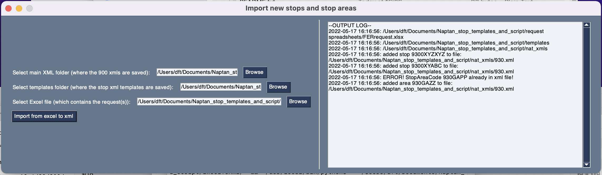

# NaPTAN-xlsx-xml-import
This code imports stop information from a spreadsheet, downloads XML files from NaPTAN website then validate and adds stop information to those XML files.

1. Load spreadsheet [✅️**Done**✅️]
2. Download required xml files from NaPTAN [✅️**Done**✅️]
3. Validate entries [🟡**Partially done**🟡]
    1. alert if atco codes are already in the xml [✅️**Done**✅️]
    2. validate the types for each field [🔴**not done**🔴]
4. Insert into template [✅️**Done**✅️]
5. Insert completed template into big xml file [🟡**Partially done**🟡]
    1. add stops to stop points and areas to stop areas [✅️**Done**✅️]
    2. if there is an existing record update instead [🔴**not done**🔴]
6. Upload updated xml files using NaPTAN login? [🔴**not done**🔴]
7. Create a basic UI for this [✅️**Done**✅️]
8. Compile UI into an executable [✅️**Done**✅️]

## To run:
pip3 install -r requirements.txt

then run: ExcelToXml.py

